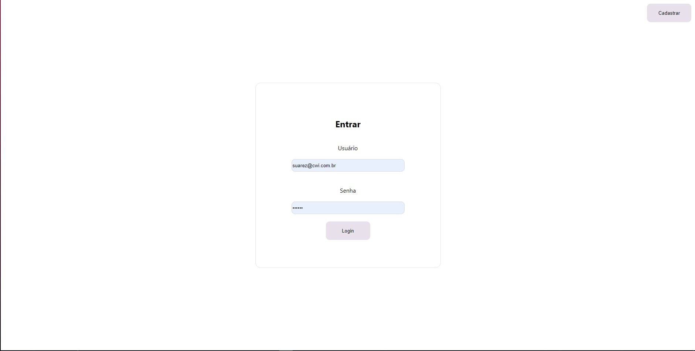
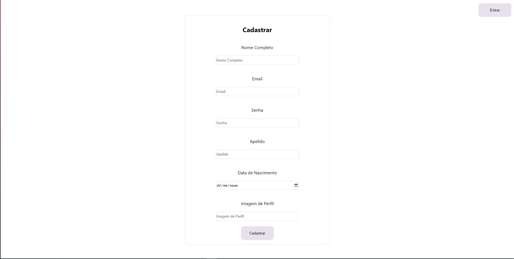
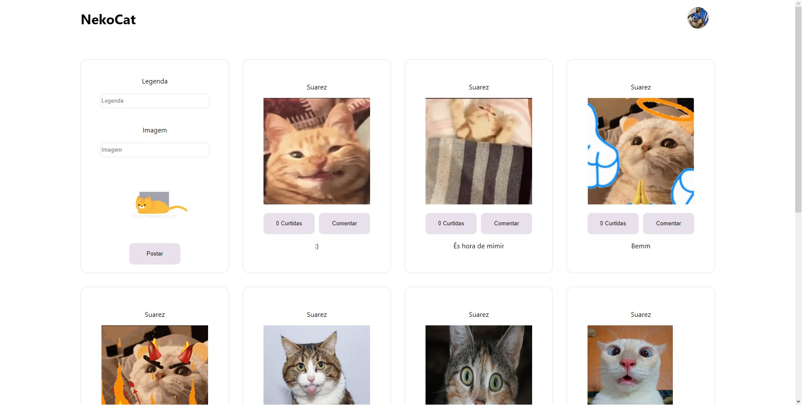
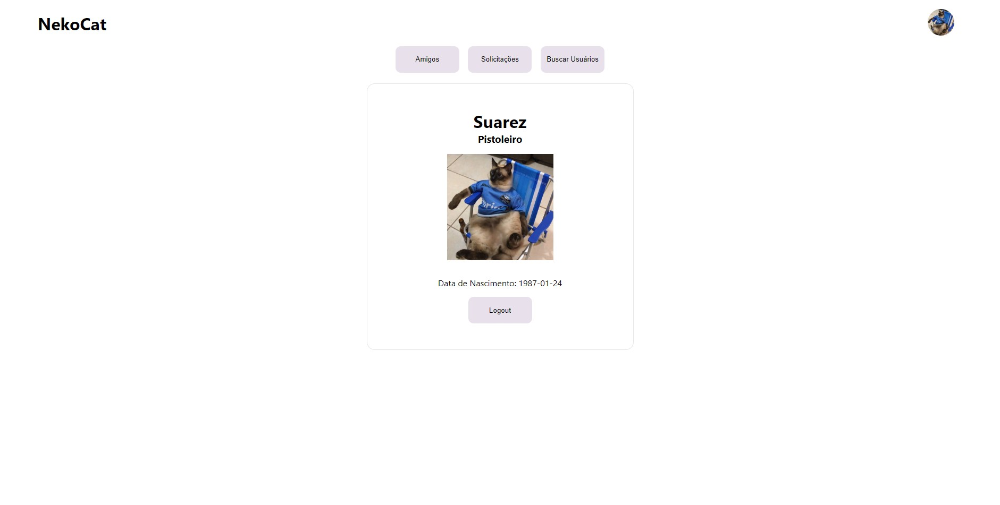

# TCC Java: NekoCat

# API

## Funcionalidades

### URL Base

```http
http://localhost:8080
```

### PostController

```
POST: /posts/: Incluir

GET: /posts/me: Buscar

GET: /posts/me/detalhe: BuscarDetalhado

GET: /posts/pesquisar: Pesquisar

PUT: /posts/amigos/{amigoId}/solicitar: SolicitarAmizade

PUT: /posts/amigos/{amigoId}/adicionar: AdicionarAmigo

PUT: /posts/amigos/{amigoId}/rejeitar: RejeitarAmigo

PUT: /posts/amigos/{amigoId}/remover: RemoverAmizade
```

### ComentarioController

```
POST /comentarios/{postId}/comentar: IncluirComentario
```

### UsuarioController

```
POST /usuarios: Incluir

GET /usuarios/me: Buscar

GET /usuarios/me/detalhe: BuscarDetalhado

GET /usuarios/pesquisar: Pesquisar

PUT /usuarios/amigos/{amigoId}/solicitar: SolicitarAmizade

PUT /usuarios/amigos/{amigoId}/adicionar: AdicionarAmigo

PUT /usuarios/amigos/{amigoId}/rejeitar: RejeitarAmigo

PUT /usuarios/amigos/{amigoId}/remover: RemoverAmizade
```

### LoginController

```
POST /login: Login
```

## Schema

```sql
DROP TABLE IF EXISTS usuario CASCADE;
DROP TABLE IF EXISTS amigo CASCADE;
DROP TABLE IF EXISTS post CASCADE;
DROP TABLE IF EXISTS usuario_curtida CASCADE;
DROP TABLE IF EXISTS comentario CASCADE;
DROP TABLE IF EXISTS permissao CASCADE;
DROP TABLE IF EXISTS solicitacao CASCADE;

CREATE TABLE usuario (
   id BIGINT GENERATED BY DEFAULT AS IDENTITY NOT NULL,
    nome VARCHAR(255) NOT NULL,
	email VARCHAR(255) NOT NULL,
	apelido VARCHAR(50),
	data_nascimento DATE NOT NULL,
	senha VARCHAR(128) NOT NULL,
	imagem_perfil VARCHAR(512),
	ativo BOOLEAN NOT NULL
);

ALTER TABLE usuario ADD CONSTRAINT pk_usuario PRIMARY KEY (id);
ALTER TABLE usuario ADD CONSTRAINT uk_usuario_email UNIQUE (email);

CREATE TABLE amigo (
	id BIGINT GENERATED BY DEFAULT AS IDENTITY NOT NULL,
	usuario_id BIGINT NOT NULL,
	amigo_id BIGINT NOT NULL
);

ALTER TABLE amigo ADD CONSTRAINT pk_amigo PRIMARY KEY (id);
ALTER TABLE amigo ADD CONSTRAINT fk_amigo_usuario FOREIGN KEY (usuario_id) REFERENCES usuario;
ALTER TABLE amigo ADD CONSTRAINT fk_amigo_amigo FOREIGN KEY (amigo_id) REFERENCES usuario;

CREATE TABLE post (
	id BIGINT GENERATED BY DEFAULT AS IDENTITY NOT NULL,
	usuario_id BIGINT NOT NULL,
	imagem VARCHAR(512) NOT NULL,
	legenda VARCHAR(300) NOT NULL,
	total_curtidas BIGINT NOT NULL,
	data_postagem TIMESTAMP NOT NULL,
	visualizacao VARCHAR(7) NOT NULL
);

ALTER TABLE post ADD CONSTRAINT pk_post PRIMARY KEY (id);
ALTER TABLE post ADD CONSTRAINT chk_post_total_curtidas CHECK (total_curtidas > -1);
ALTER TABLE post ADD CONSTRAINT fk_post_usuario FOREIGN KEY (usuario_id) REFERENCES usuario;

CREATE TABLE usuario_curtida (
	id BIGINT GENERATED BY DEFAULT AS IDENTITY NOT NULL,
	usuario_id BIGINT NOT NULL,
	post_id BIGINT NOT NULL
);

ALTER TABLE usuario_curtida ADD CONSTRAINT pk_usuario_curtida PRIMARY KEY (id);
ALTER TABLE usuario_curtida ADD CONSTRAINT fk_usuario_curtida_usuario FOREIGN KEY (usuario_id) REFERENCES usuario;
ALTER TABLE usuario_curtida ADD CONSTRAINT fk_usuario_curtida_post FOREIGN KEY (post_id) REFERENCES post;

CREATE TABLE comentario (
	id BIGINT GENERATED BY DEFAULT AS IDENTITY NOT NULL,
	comentario VARCHAR(100) NOT NUll,
	data_postagem TIMESTAMP NOT NULL,
	post_id BIGINT NOT NULL,
	usuario_id BIGINT NOT NULL
);

ALTER TABLE comentario ADD CONSTRAINT pk_comentario PRIMARY KEY (id);
ALTER TABLE comentario ADD CONSTRAINT fk_comentario_usuario FOREIGN KEY (usuario_id) REFERENCES usuario;
ALTER TABLE comentario ADD CONSTRAINT fk_comentario_post FOREIGN KEY (post_id) REFERENCES post;

CREATE TABLE permissao (
	id BIGINT GENERATED BY DEFAULT AS IDENTITY NOT NULL,
	nome VARCHAR(100) NOT NULL,
	usuario_id BIGINT NOT NULL
);
ALTER TABLE permissao ADD CONSTRAINT pk_permissao PRIMARY KEY (id);
ALTER TABLE permissao ADD CONSTRAINT uk_permissao UNIQUE (nome, usuario_id);
ALTER TABLE permissao ADD CONSTRAINT fk_permissao_usuario FOREIGN KEY (usuario_id) REFERENCES usuario;

CREATE TABLE solicitacao (
    id BIGINT GENERATED BY DEFAULT AS IDENTITY NOT NULL,
    usuario_id BIGINT NOT NULL,
    amigo_id BIGINT NOT NULL
);
ALTER TABLE solicitacao ADD CONSTRAINT pk_solicitacao PRIMARY KEY (id);
ALTER TABLE solicitacao ADD CONSTRAINT fk_solicitacao_usuario FOREIGN KEY (usuario_id) REFERENCES usuario;
ALTER TABLE solicitacao ADD CONSTRAINT fk_solicitacao_amigo FOREIGN KEY (usuario_id) REFERENCES usuario;
```

## Inserts

```sql
-- Usuario

INSERT INTO usuario (nome, email, apelido, data_nascimento, senha, imagem_perfil, ativo)
VALUES ('John Doe', 'johndoe@example.com', 'johnd', '1990-01-01', 'password123', 'https://lh3.googleusercontent.com/a-/AAuE7mDlbqjs7q5r05ijcnGPxmHJ4pWc4CUyyVgXPVU3', true);

INSERT INTO usuario (nome, email, apelido, data_nascimento, senha, imagem_perfil, ativo)
VALUES ('Victor Constantine', 'vicConst@example.com', 'vcC', '1990-01-01', 'password123', 'https://images.fineartamerica.com/images/artworkimages/mediumlarge/3/cat-craziness-cute-kawaii-adorable-funny-cool-kitty-cutesy-japanese-random-awesome-trippy-weird-rahim-rd.jpg', true);

INSERT INTO usuario (nome, email, apelido, data_nascimento, senha, imagem_perfil, ativo)
VALUES ('Emma Zapson', 'emmaZ@example.com', 'iLvCts', '1990-01-01', 'password123', 'https://encrypted-tbn0.gstatic.com/images?q=tbn:ANd9GcR6AQC0Q8K5lJV6zw4AJd2YvnwkKg12uUgSeA&usqp=CAU', true);

-- Post

INSERT INTO post (usuario_id, imagem, legenda, total_curtidas, data_postagem, visualizacao)
VALUES
	(1, 'https://media.tenor.com/_k0gzG8pCXsAAAAC/gatinho-gatinho-cobertor.gifg', 'This is a caption', 10, '2022-01-01 10:00:00', 'PUBLICO'),
	(1, 'https://seres.vet/blog/wp-content/uploads/2020/10/gato-vomitando-bola-de-pelo-2.jpg', 'Another caption', 5, '2022-02-01 10:00:00', 'PUBLICO'),
	(2, 'https://encrypted-tbn0.gstatic.com/images?q=tbn:ANd9GcTffoQE6xhKmu7dhs6BxYYQSpNdahUzSbKjYAnX8S2wFxsjcO09ODomODEsjlSRtzMZJNQ&usqp=CAU', 'Yet another caption', 20, '2022-03-01 10:00:00', 'PUBLICO');
```

# APP

### Imagens





